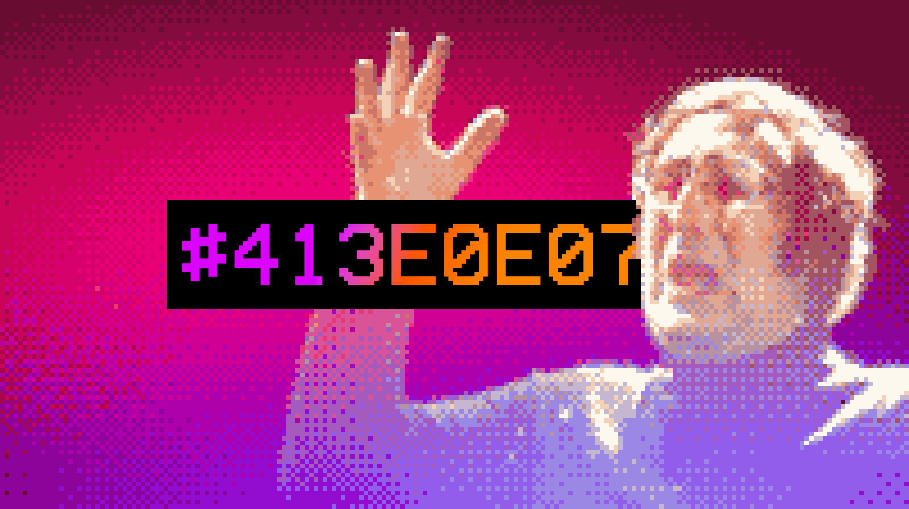
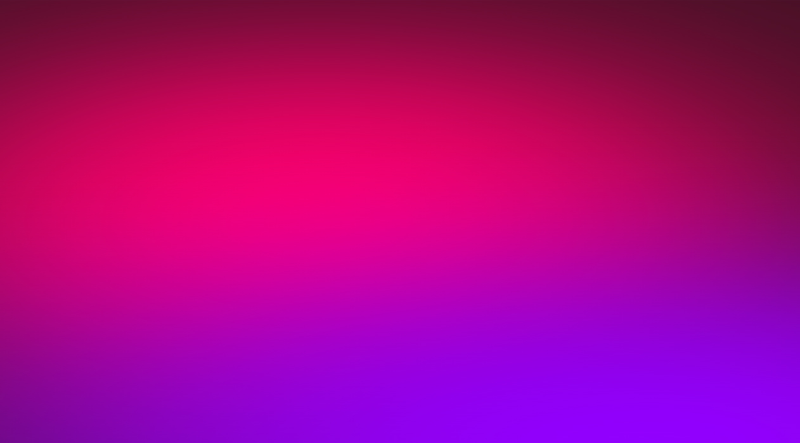
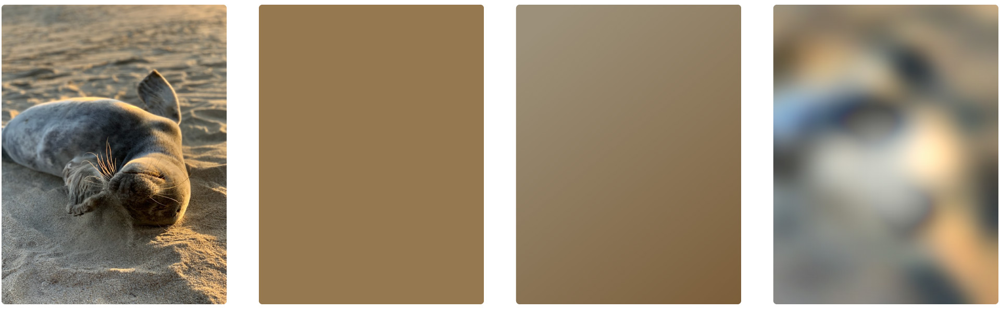
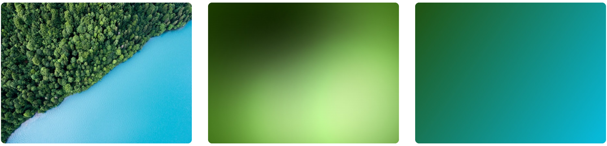
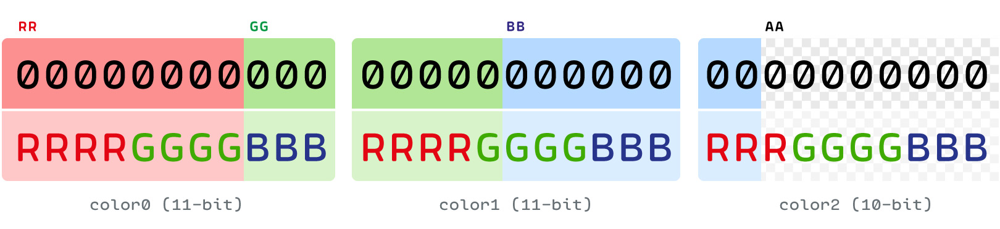
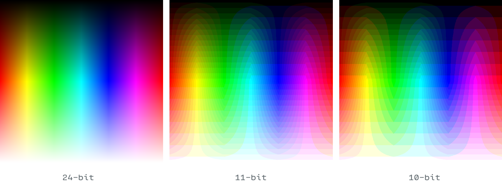
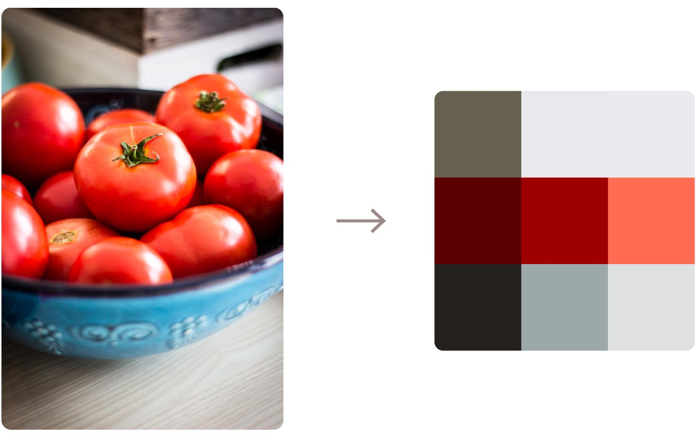
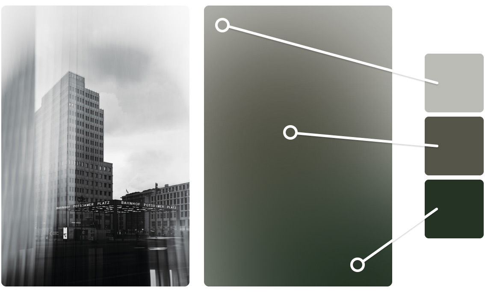
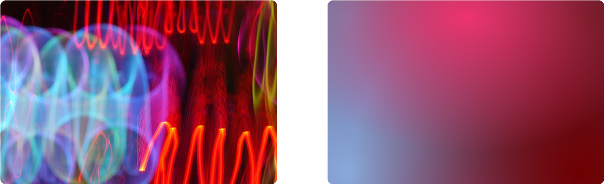
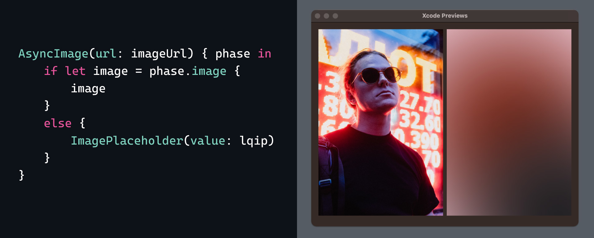

> Originally published on [Medium](https://medium.com/@frzi/lqip-css-73dc6dda2529), August 18, 2025



# Image placeholders in pure CSS — or: Defying gods with math and color
> Creating an LQIP in pure CSS using nothing but math, color and a bit of shenanigans

## Behold
... the absolute wickedness one can achieve with CSS. With just a single hex code…


... we can create this:




It may not look impressive, but that's a 3-color "mesh gradient"  image to act as an LQIP (Low Quality Image Placeholder).

---

A while back [Lean Rada](https://leanrada.com/) stunned the web development community with an ingenious trick: [A CSS-only LQIP implementation](https://leanrada.com/notes/css-only-lqip/). With a single value between -999,999 and 999,999 they create a blurry low-res representation of an image as a placeholder, entirely via CSS. I implore you to read their article to have your brain wrinkled because I cannot overstate how brilliant this is.

This inspired me to explore other avenues of implementing LQIPs, purely in CSS. Not to create something *better* (like hell I could), but to harness CSS' power differently and see what else is possible.

Before we get into the technical nitty gritty, we first have to talk about LQIPs as a concept and the benefits of implementing LQIPs via CSS. If you're already well up to speed, or just don't care, you can ⌘-F (or Ctrl-F) the 🧪 emoji to jump to [the code and the science](#-the-code-and-the-science) behind it all!

[Don't forget to check the implementation in action over here](https://frzi.github.io/lqip-css/).

---

## What the doggone flipping heck is an LQIP?
First of all, watch your language. Second, you've undoubtedly seen them before! You visit a site or open an app, but before the images are fully downloaded you are presented with an abstract representation in their place. This is called an LQIP :  a Low Quality Image Placeholder. And they come in different forms. Like a single color (often the [dominant color](https://www.color-meanings.com/dominant-recessive-colors/)), a simple gradient of two colors, or perhaps a very blurry low-resolution version of the original image.


> Photo by [Lachlan](https://unsplash.com/@lachlancormie?utm_content=creditCopyText&utm_medium=referral&utm_source=unsplash) on [Unsplash](https://unsplash.com/photos/sea-lion-on-brown-sand-during-daytime-DJgNuM5NEKE?utm_content=creditCopyText&utm_medium=referral&utm_source=unsplash)

They're a fancy feature that improve the UX ever so slightly: It prevents your site/app from looking barren when opening; they can help users potentially identify images early, but most importantly: they're damn *exquisite* and show that you - the developer - care about the details. 😎

That said, they're not as common as we probably think they are.

Implementing LQIPs requires some forethought on the backend side of things. Images have to be analysed, an LQIP has to be encoded into some form of "representation", this "representation" then has to be stored somewhere for later use (e.g. a database). Finally, the frontend needs to receive these "representations" (preferably in the earliest payload) and generate the placeholder before downloading and showing the original image.

The second challenge is the fact an LQIP is *more* data you have to send to the frontend... And as a developer you want to avoid the point of diminishing returns: where the bandwidth (and time) of the extra data could've been better spent downloading the original files instead.

This is where the fight truly begins: finding an LQIP implementation that performs well and requires as little data as possible. Due to this extra hassle some developers opt to simply use [Progressive JPEGs](https://www.hostinger.com/tutorials/what-is-progressive-jpeg-images) instead. Which isn't a replacement for LQIPs *entirely*, but does present images to the user faster for an improved UX.


## Different LQIP implementations
Perhaps the most common and naive way to implement LQIPs is by creating a low-res image of the original and have the frontend download it before downloading the original (or simultaneously).

Seems simple enough. But the drawback of this is the frontend will have to make *more* requests to the backend to download *more* files, which in turn is *more* data going back and forth.

Alternatively, the low-res image can be embedded inline into the HTML/CSS as a base64 string. Just search for ["lqip" on npmjs.com](https://www.npmjs.com/search?q=lqip) to find countless packages doing exactly that for Vite and Webpack.

```html

```

The drawback here, of course, is base64 makes files **33% larger**. So… hmm, yes, less requests but bigger payloads. ¯\\\_(ツ)\_/¯

[Blurhash](https://blurha.sh) attempts to combat this. Rather than embedding a whole-ass image, a base83 string representation is created of a very *very* ***very*** low-res version instead. This string is then embedded into the HTML element as an attribute. Using JavaScript the base83 strings are read, decoded and an *m×n* mesh gradient image is generated.

```html

```

The drawback here being… well, I'm saving that for the next section.

A final worthy mention is [SQIP](https://axe312ger.github.io/sqip/). Which uses SVG as LQIPs instead of tiny raster images. What's interesting about SVG is it's a very versatile format. It being vector based makes the graphic responsive and sharp at any resolution. Its [filters feature](https://yoksel.github.io/svg-filters/) allows you to add some seriously sick (realtime) effects too.

... but the SVGs you embed are still going to be hundreds of bytes large. Less – but still comparable – to base64 encoded JPEGs and WebPs.

Which brings us to…


## The benefits of a pure CSS implementation
Going back to [Blurhash](https://blurha.sh), a bit of JavaScript is required on the frontend. However, let's (mentally) go through the steps such JavaScript would have to go through.

First, all the elements in the DOM that are relevant need to be queried.

```js
const images = document.querySelectorAll('img[data-lqip]')
```

For this to work proper you will most certainly have to wait for the DOM to finish parsing.

```js
addEventListener('DOMContentLoaded', () => {
  parseLQIPs()
})
```

You then go through each element, read the hash, decode it and finally - somehow - render the LQIP. Blurhash does this by creating the gradients in a `<canvas>`, [**pixel by pixel**](https://github.com/woltapp/blurhash/blob/master/TypeScript/src/decode.ts#L62).

It feels intuitive and gives you full control over the whole process, yes. But it's also *slow*. You know what's faster and more direct? CSS! Because:


### CSS is blocking
It means the browser won't render your page before your stylesheet(s) is fully loaded. Which is a *good* thing. It does so to prevent the dreadful [Flash of Unstyled Content](https://en.wikipedia.org/wiki/Flash_of_unstyled_content). The best part here is that the CSS solution works from the **very first moment** your page is visible. Even before the entire HTML is parsed!


### CSS lets the browser do the rendering
As a frontend web developer you should know: nothing is faster than the browser itself. Something like CSS' `linear-gradient()` is going to outperform drawing a gradient onto a canvas via JavaScript. Better yet, the browser will also redraw the gradient whenever the element (or screen) changes size. Meaning our gradients will look ✨pristine✨ regardless of screen resolution or element size.


### CSS is easier to implement (and less code)
Let's say your website or webapp loads images dynamically. Applying the LQIP is literally a single line of code:

```js
image.style.setProperty('--lqip', lqipValue)
```
Same thing if you're using a framework like React. There's no need for extra components et al to handle any extra logic. Just pop that CSS variable in there and Bob's your uncle!

```jsx
const style = {
  '--lqip': lqipValue
}

return 
```

Too easy.

With all that said you should now have a better understanding of LQIPs and the benefits of a pure CSS solution. Hopefully you're as giddy as I am because it's time for ***s c i e n c e !***

---

## 🧪 The code and the science!
The goal was to make a minimalist LQIP implementation that supported at least two colors. The other goal was to have the data stored in a single CSS variable.


> Lean's LQIP (2nd box) using a single hue vs my initial goal (3rd box) using 2 dominant colors | Photo by [Andreas Gücklhorn](https://unsplash.com/@draufsicht?utm_content=creditCopyText&utm_medium=referral&utm_source=unsplash) on [Unsplash](https://unsplash.com/photos/birds-eye-view-photography-of-trees-and-body-of-water-mawU2PoJWfU?utm_content=creditCopyText&utm_medium=referral&utm_source=unsplash)

The first place to look, of course, is [`<integer>`](https://developer.mozilla.org/en-US/docs/Web/CSS/integer). Although undocumented, CSS integers have a safe range of -1,000,000 to 1,000,000. Which makes it *almost* a 20-bit value. Still, that's plenty of space to store some data. The other benefit being the closer the value is to 0, the less bytes you need to write it.

```css
--lqip:-1000000; /* 16 bytes */
--lqip:0; /* 9 bytes */
```

But we can do better. There's a value type in CSS that has an even bigger range. And it's one that's been available since CSS variables became a thing: [`<color>`](https://developer.mozilla.org/en-US/docs/Web/CSS/color_value). More specifically, its RGBA hex form: [`#RRGGBBAA`](https://www.w3.org/TR/css-color-4/#hex-notation).

RGBA are four 8-bit values put together, resulting in a single whopping 32-bit value. That's a lot of bits to put data in. Initially the goal was to pack two colors… but greed prevailed and I decided to pack ***three*** colors instead. The first two colors being 11-bit, the last one being 10-bit.



This **will** limit the color precision, yes. Significantly so. With fewer bits we have lower ranges to work with. But this is the trade-off we can make. After all, the LQIP is going to be some blurry mess. Exact color precision is not of the utmost importance. Besides, the LQIP is only going to be shown temporarily until the original image is loaded in. Who's gonna notice?



> Comparing the color precision. (Note: not the entire range)

## Let's get cracking
First, we need the colors we are gonna cram into a single RGBA. There are several ways to do this, including the pretty complicated [color quantization](https://en.wikipedia.org/wiki/Color_quantization). But I decided to keep things simple: resize the image to a puny 3x3 resolution and grab the colors there.



> Photo by [Deniz Altindas](https://unsplash.com/@omeganova?utm_content=creditCopyText&utm_medium=referral&utm_source=unsplash) on [Unsplash](https://unsplash.com/photos/a-bowl-of-red-tomatoes-jVLahCBXaJs?utm_content=creditCopyText&utm_medium=referral&utm_source=unsplash)

I didn't want a boring, linear gradient for the LQIP. Rather, it'd be nice if there was *some* shape and definition in there. So the LQIP will be built from a solid background color and two radial gradients placed on top, in a diagonal position. The colors will be grabbed from the top-left corner, the center and the bottom-right corner pixels of the 3x3 version.


### Packing
Right, time to compress the ever loving ████ out of these ███ █████ █████ f████ing colors.

Packing the colors into a 11-bit and 10-bit integer is pretty straightforward if you're familiar with bitwise operators.

```ts
type RGB = { r: number, g: number, b: number }

function packColor11bit(c: RGB): number {
  const r = Math.round((c.r / 0xFF) * 0b1111)
  const g = Math.round((c.g / 0xFF) * 0b1111)
  const b = Math.round((c.b / 0xFF) * 0b111)
  return (r << 7) | (g << 3) | b
}

function packColor10bit(c: RGB): number {
  const r = Math.round((c.r / 0xFF) * 0b111)
  const g = Math.round((c.g / 0xFF) * 0b1111)
  const b = Math.round((c.b / 0xFF) * 0b111)
  return (r << 7) | (g << 3) | b
}
```

With the colors packed we now combine them into a single integer and create the hex code.

```js
const pc0 = packColor11bit(c0)
const pc1 = packColor11bit(c1)
const pc2 = packColor10bit(c2)
const combined = (BigInt(pc0) << 21n) | (BigInt(pc1) << 10n) | BigInt(pc2)
const hex = '#' + combined.toString(16).padStart(8, '0')
```

We put the hex code we created as a custom CSS variable for every element that requires a LQIP. Typically you'd put these only on `` elements. But nothing is stopping you from putting them anywhere else, I guess.

```html

```

### Unpacking
Now comes the fun part. Unpacking the colors from the single RGBA hex code in CSS. 

CSS does **not** have any bitwise operators. But it **does** have math functions like [`round()`](https://developer.mozilla.org/en-US/docs/Web/CSS/round) and [`mod()`](https://developer.mozilla.org/en-US/docs/Web/CSS/mod). As luck would have it, that's enough to "emulate" bitwise operations to snatch the bits from the RGBA hex.

But how do we get the bits from a specific color channel? There's no function to just get, like, the red value from a color.
 
Or is there…?

Actually there is! And it's (exclusively) possible in the [relative color syntax](https://developer.mozilla.org/en-US/docs/Web/CSS/color_value/color#using_relative_colors_with_color).

```css
--new-color: color(from var(--old-color) srgb r g b / alpha);
/* Alternatively */
--new-color: rgb(from var(--old-color) r g b / alpha);
```

The relative color syntax allows us to read and perform calculations on the individual channels of the color. Arbitrarily, even; you can swap the channels if you'd like! This is perfect. Because all we need to do is read from one color to create a new color.

The red of the first color are the first 4 bits of the red in the RGBA hex. This means we have to bit shift the value 4 bits to the right, then divide by 15 (the maximum 4-bit value (2⁴-1)). The calculation looks like this:

```css
calc(round(down, r * 255 / pow(2,4)) / 15)
```

For green we need the last 4 bits of the red channel in the RGBA hex. Here we use `mod()` to emulate a bitwise AND:

```css
calc(mod(round(down, r * 255), pow(2,4)) / 15)
```

With the basic maths explained, here's the full CSS code to unpack three colors from a single RGBA hex code:

```css
--lqip-c0: color(
  from var(--lqip)
  srgb
  calc(round(down, r * 255 / pow(2,4)) / 15)
  calc(mod(round(down, r * 255), pow(2,4)) / 15)
  calc(round(down, g * 255 / pow(2,5)) / 7)
  / 100%
);

--lqip-c1: color(
  from var(--lqip)
  srgb
  calc(mod(round(down, g * 255 / 2), pow(2,4)) / 15)
  calc(((mod(round(down, g * 255), 2) * pow(2,3)) + (round(down, b * 255 / pow(2,5)))) / 15)
  calc(mod(round(down, b * 255 / pow(2,2)), pow(2,3)) / 7)
  / 100%
);

--lqip-c2: color(
  from var(--lqip)
  srgb
  calc((((mod(round(down, b * 255), pow(2,2)) * 2)) + round(down, alpha * 255 / pow(2,7))) / 7)
  calc(mod(round(down, alpha * 255 / pow(2,3)), pow(2,4)) / 15)
  calc(mod(round(down, alpha * 255), pow(2,3)) / 7)
  / 100%
);
```

Hooo boy. 😑 With that out of the way we can finally construct our LQIP.

Lean figured out a radial gradient can look more attractive by using an [eased interpolation](https://leanrada.com/notes/css-only-lqip/#:~:text=Bilinear%20interpolation%20approximation%20with%20radial%20gradients), rather than a linear one. (I'm paraphrasing here) So for our gradients we'll do just that: set the steps at every 10% to simulate the easing. The `background` property – and the final piece of the puzzle – looks like this:

```css
background:
  radial-gradient(
    150% 75% at 80% 100%,
    var(--lqip-c2),
    rgb(from var(--lqip-c2) r g b / 98%) 10%,
    rgb(from var(--lqip-c2) r g b / 92%) 20%,
    rgb(from var(--lqip-c2) r g b / 82%) 30%,
    rgb(from var(--lqip-c2) r g b / 68%) 40%,
    rgb(from var(--lqip-c2) r g b / 32%) 60%,
    rgb(from var(--lqip-c2) r g b / 18%) 70%,
    rgb(from var(--lqip-c2) r g b / 8%) 80%,
    rgb(from var(--lqip-c2) r g b / 2%) 90%,
    transparent
  ),
  radial-gradient(
    100% 75% at 40% 50%,
    var(--lqip-c1),
    rgb(from var(--lqip-c1) r g b / 98%) 10%,
    rgb(from var(--lqip-c1) r g b / 92%) 20%,
    rgb(from var(--lqip-c1) r g b / 82%) 30%,
    rgb(from var(--lqip-c1) r g b / 68%) 40%,
    rgb(from var(--lqip-c1) r g b / 32%) 60%,
    rgb(from var(--lqip-c1) r g b / 18%) 70%,
    rgb(from var(--lqip-c1) r g b / 8%) 80%,
    rgb(from var(--lqip-c1) r g b / 2%) 90%,
    transparent
  ),
  var(--lqip-c0);
```


## 🏁 Done!
And there you have it. With very little code and very easy math we have:

* A representation of an LQIP that is incredibly minimal and requires but a few bytes to be sent to the frontend. The frontend implementation is also minuscule. A huge bandwidth saver.
* An LQIP that performs well and is responsive thanks to letting the browser do the heavy lifting.
* An implementation that can be applied beyond just websites and webapps (refer to [Appendix B](#appendix-b-native-app-implementation) for an example).
* Defied the gods and harnessed a new unthinkable power in CSS. 

Don't forget, [you can see the LQIP in action here, as well try out your own images](https://frzi.github.io/lqip-css/).


## What now?
Like most things in life, it's not perfekt; there's still room for improvement.

For instance: near gray colors may turn more saturated and become more colorful due to the lack of precision. One could better analyze the colors picked out of the 3x3 image before packing them into the RGBA. (Or use a different method altogether.)



> A black/white image showing brown- and greenish colors in the LQIP due to the RGB channels being rounded differently when packed to lower bit values | Photo by [Nikita Pishchugin](https://unsplash.com/@nikita_pishchugin?utm_content=creditCopyText&utm_medium=referral&utm_source=unsplash) on [Unsplash](https://unsplash.com/photos/a-high-rise-building-stands-at-potsdamer-platz-in-berlin-zYyKL6LnzSU?utm_content=creditCopyText&utm_medium=referral&utm_source=unsplash)

Another idea is to add a *second* CSS variable for three more colors to create a six color mesh gradient:

```html

```


> Photo by [Jose G. Ortega Castro](https://unsplash.com/@j0rt?utm_content=creditCopyText&utm_medium=referral&utm_source=unsplash) on [Unsplash](https://unsplash.com/photos/red-and-yellow-light-streaks-j-stvO_SzE8)

---

**Thank you** very much for reading. Hopefully this article inspired you just as much as Lean's article inspired me. It feels like there's still a huge world of CSS potential left to discover. And it always excites me when people come up with new mind-boggling, ingenious, Einstein-levels of brilliance tricks. Please share them with the world!

* The repository can be found on [GitHub](https://github.com/frzi/lqip-css).
* This article is also posted on [Medium](https://medium.com/@frzi/lqip-css-73dc6dda2529).
* This article is also posted on [DEV.to](https://dev.to/frzi/image-placeholders-in-pure-css-or-defying-gods-with-math-and-color-3a5d).

Thanks again! 🤗

---

## Appendix A: Embedded as attribute
In the (near?) future we should be able to utilise [`attr()`](https://developer.mozilla.org/en-US/docs/Web/CSS/attr#color_value), allowing us to put the hex code as a separate attribute and read it as a color in CSS. This would make placing the hex code in the element easier for the backend; no longer having to jam the code awkwardly in a `style=""`.

```html

```
```css
[data-lqip] {
  --lqip: attr(data-lqip type(<color>), white);
  /* ... */
}
```

## Appendix B: Native app implementation
Being a Swift developer as well I figured it's worth showing how easy it is to code this LQIP implementation in a SwiftUI app. Just to prove the technique is not necessarily web (CSS) exclusive.



> Photo by [Vicky Hladynets](https://unsplash.com/@vhladynets?utm_content=creditCopyText&utm_medium=referral&utm_source=unsplash) on [Unsplash](https://unsplash.com/photos/man-in-black-crew-neck-shirt-wearing-black-sunglasses-sDDtChahKQ4)

The Swift code can be found in the [GitHub Gist](https://gist.github.com/frzi/f13203d42a47c3d167b27135d98d6098).

