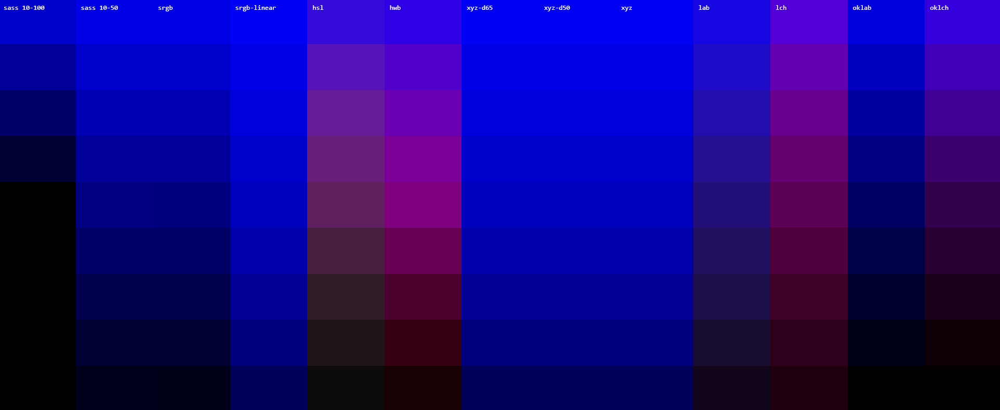
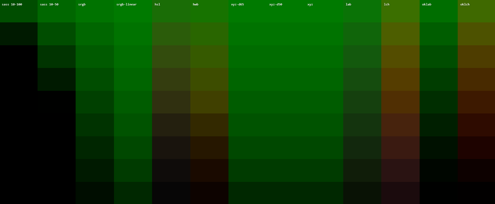
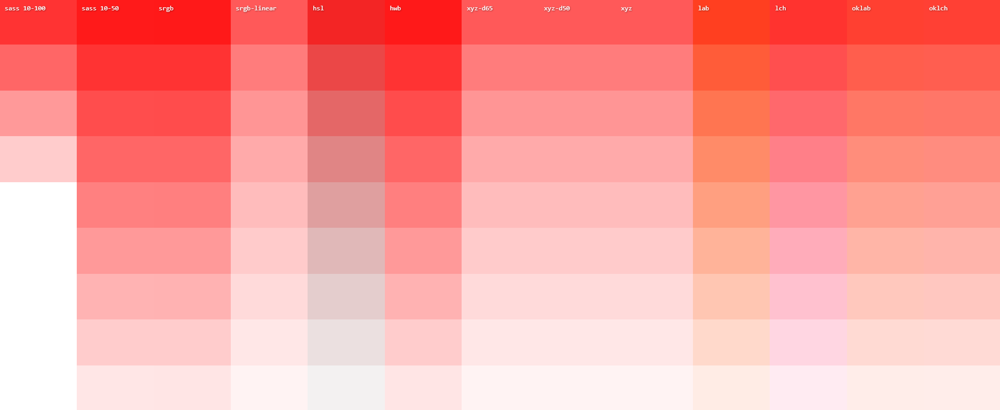

> Originally published on [Medium](https://medium.com/@frzi/less-sass-more-color-mix-or-color-manipulation-with-pure-css-dbf6f244ef29), April 23, 2023

# Less Sass, more color-mix, - or: color manipulation with pure CSS


**⚠ ️This article will become redundant once all browsers support the CSS Color Module 5 [relative color syntax](https://developer.chrome.com/blog/css-relative-color-syntax/).**

`color-mix()` is creeping into browsers! It's now available in Safari, Chrome (partially (see bottom)) and should ship in Firefox soon (it's currently behind a config flag).

This article assumes you're already aware of `color-mix()`'s existence. If this is the first time you're reading about it, I highly recommend you read [Chrome Developer's blogpost about this amazing new CSS function](https://developer.chrome.com/blog/css-color-mix/) first.

<hr>

Just like [nesting](https://developer.chrome.com/articles/css-nesting/), CSS is slowly growing stronger by adopting features we normally would need preprocessors like Less and Sass for. Another one of those features - which will be discussed in this article - is *color manipulation*.

## Changing the alpha value (opacity)
In both Less and Sass we can use variables to create the same color but with a different alpha value.
```scss
$color-primary: rgb(255 125 0);
color: rgb($color-primary, 0.5);
```
The alpha value can even be overridden if it was specifically declared in the variable.
```scss
$color-highlight: rgb(255 125 0 / 0.5); // Alpha of 0.5
background-color: rgb($color-highlight, 0.9); // Overridden to have an alpha of 0.9
```
Now this isn't *really* anything special. We can already achieve something similar with pure CSS. That is, if we were to declare the RGB values in a separate variable we can use said variable in `rgb()`:
```css
--color-primary-rgb: 255 125 0;
--color-primary: rgb(var(--color-primary-rgb));

background-color: rgb(var(--color-primary-rgb) / 0.75);
color: var(--color-primary);
```

Of course, if we were to do this for *every* ***possible*** color, we'd end up with a hell of a lot variables. Luckily we can also adjust the alpha value with `color-mix()`! The magic trick is using `transparent`:
```css
--color-primary: rgb(255 125 0);

color: color-mix(in srgb, transparent, var(--color-primary) 75%); /* rgb(255 225 0 / 0.75)
```
By mixing a color with `transparent` we get the same color back (the same RGB) but with a different alpha value. Because the `75%` is grouped with the CSS variable it means the resulting color uses 75% of the color on the right, which has an alpha value of 1.0. Thus the resulting color would be the same as `rgb(255 125 0 / 0.75)`. If the `75%` was grouped with `transparent` then the resulting color would be `rgb(255 125 0 / 0.25)`.

## `darken()` and `lighten()`
Both Less and Sass supply a bunch of useful color functions. Two of those are `darken()` and `lighten()`. As their name already tells you these functions return a darker and a lighter variant of a given color, based on a give percentage:
```less
@color-primary: rgb(255 125 0);
background-color: darken(@color-primary, 20%); // A '20%' darker color.
```
But thanks to `color-mix()` we can now get the same effect using pure CSS! The trick? Use either `black` or `white` to darken or lighten the color respectively:
```css
--color-primary: rgb(255 125 0);
background-color: color-mix(in srgb, black 20%, var(--color-primary)); /* Darken by 20% */
background-color: color-mix(in srgb, white 20%, var(--color-primary)); /* Lighten by 20% */
```

Now there are two things to consider and keep in mind: 
* The percentage you use in the Less/Sass functions does not match what you'd use in `color-mix()`.
* Depending on the colorspace you will get different results.

[In this Codepen we can compare and test colors between the available colorspaces as well as Sass' `darken()` function](https://codepen.io/frzi/pen/qBJaJLM).


The first two columns show Sass' `darken()` function. All columns demonstrate a range from 10% to 90%, with the exception of the second column: which uses 5% to 50%. This is because both `darken()` and `lighten()` are pretty 'sensitive'.

It looks like using `srgb` (third column) and *doubling* the value you'd normally use in Sass gives similar results.

Testing with blue supports this theory:



*However*, once we try green the theory clearly fails:



For completion sake, here's comparing Sass' `lighten()` with using white in `color-mix()`:



So keep this in mind: switching from Less or Sass' `darken()` and `lighten()` to `color-mix()` isn't a simple one-to-one translation. You're gonna have to carefully test each color to make sure you either get the same - or at least similar - result.

## Conclusion
So, that's another usecase where we can use pure CSS instead of Less or Sass. Does this mean Less and Sass are becoming obsolete? Heavens no. They're preprocessors! And preprocessors will always have a role in build pipelines. Especially for bigger projects. They help us prevent shipping certain code to production. They provide us with useful utilities to either automate or write less code (e.g. loops and mixins).

That said, both Less and Sass' role ends after their compile process. They can't help us much during *runtime*. Which is exactly where features like CSS variables, `calc()`, `color-mix()`, et al. show their strength. And thus should take precedence over their Less/Sass counterparts.

## Known bugs
As of writing this there's a bug in Chrome (v112) where using `color-mix()` with CSS variables only works for `color` and `background-color`. Anything else (`box-shadow`, `border-color`, etc...) seems to give undefined behavior. Resulting in either black or the color defined in the CSS variable remaining untouched. Firefox and Safari seem fine, however.

Edit: This issue has been [fixed](https://bugs.chromium.org/p/chromium/issues/detail?id=1442130) and should arrive in either Chrome 114 or 115!